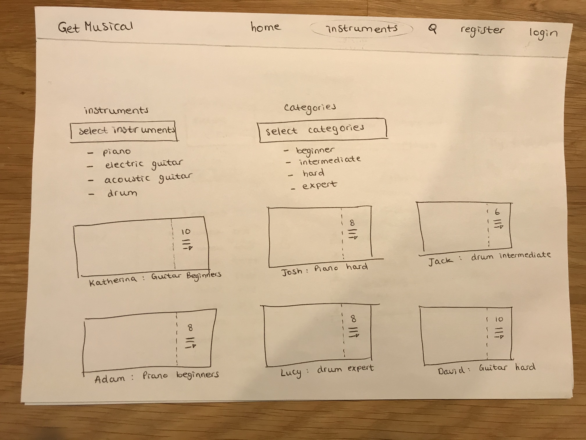
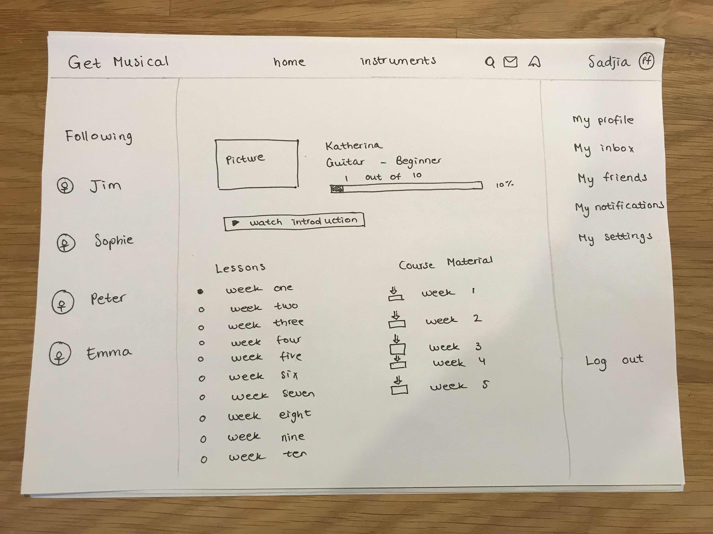

# Projectvoorstel

**Samenvatting**

Onze website heeft als thema Muziekinstrumenten. Op de website kun je tutorials over muziekinstrumenten posten, de tutorials volgen en individueel zelf je voortgang bijhouden bij het leren van een nieuw muziekinstrument door middel van posts op de website.

**Features**
- gebruikers kunnen een account aanmaken en inloggen. *MVP*
- gebruikers kunnen gebruikers volgen. *MVP*
- gebruikers kunnen op posts "liken" en "commenten" *MVP*
- gebruikers krijgen een timeline waar alle posts van hun gevolgde gebruikers weergeven worden.
- gebruikers kunnen zoeken op muziekinstrument, waarna een pagina weergeven wordt van verschillende video's met dat muziekinstrument.
- gebruikers krijgen een melding als een persoon die zij volgen een video uploaden.
- gebruikers kunnen video's uploaden waarin zij uitleggen hoe zij een muziekinstrument bespelen. *MVP*
- gebruikers kunnen een soort "cursus" aanschaffen van andere gebruikers
- gebruikers kunnen hun kennis verkopen als soort "cursus" aan beginners
- gebruikers kunnen hun voortgang volgen in een soort 'tijdbalk'
- gebruikers kunnen hun eigen geüploade instructies met een moeilijkheidsgraad beoordelen: *beginner*, *intermediate*, *hard* ,*expert*

**Afhankelijkheden**
- *externe componenten*
- bootstrap
- javascript
- *concurrenten*
- *Teoria*: Alleen leesbare informatie, geen video's
- veel websites gebaseerd op 1 muziekinstrument, met lelijk uiterlijk.

**Controllers**
- Login - post
- Register - post
- Homepage - get - dit is de homepage van de website, waar je op komt als je de website zoekt
- Follow - post - gebruikers volgen, waarna ze in je timeline verschijnen
- Comment - post - reageren onder een video
- Like - post - video leuk vinden
- Skill_level - get en post - geeft de graad aan waarin gebruiker een instrument beheerst.
- Timeline - get - Zie video's van gebruikers die gevolgd worden
- Search_instrument - post - geeft instrument en toont video's van gebruikers die dit instrument bespelen
- Notification - get - krijg een mail als een gebruiker die je volgt een video upload
- See_progress - get - krijg inzicht in de vooruitgang die gebruiker geboekt heeft
- Set_private - post - geeft gebruikers kans om account openbaar of prive te maken

**Helpers**
- login required -  zorgt dat je ingelogd moet zijn om bepaalde functies te gebruiken
- apology - geeft een excuusformulier als er iets is misgegaan
- Skill -  berekent skill level
- upload - zorgt dat je video's kunt uploaden

**Plug-Ins**
- bootstrap - https://getbootstrap.com/docs/4.4/getting-started/introduction/
- javascript - https://developer.mozilla.org/nl/docs/Web/JavaScript/Reference
- Flask - http://flask.palletsprojects.com/en/1.1.x/

